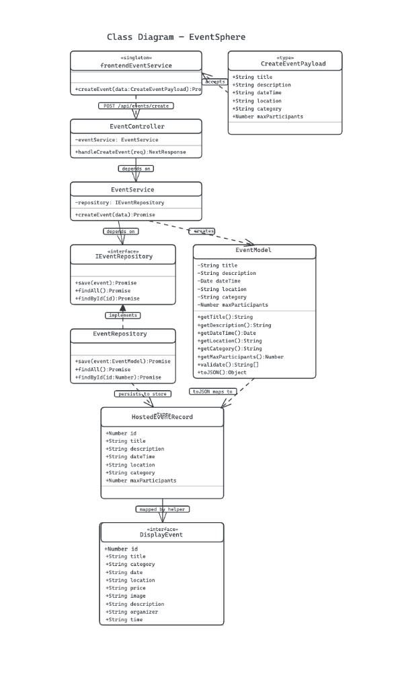
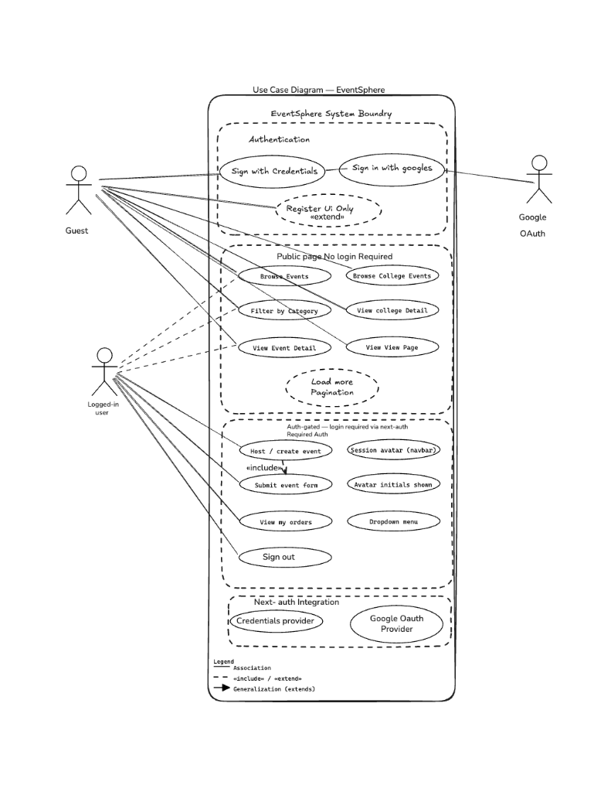
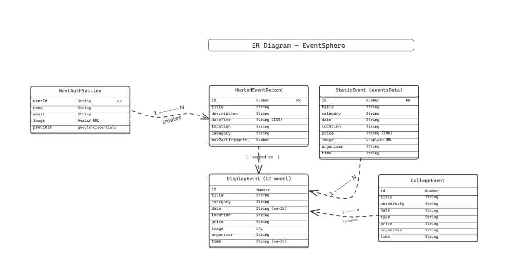

#                                                    EventSphere

> A modern, premium event booking and management platform designed to deliver seamless ticketing, exclusive student access, and secure checkout experiences.

[](https://projecteventsphere.vercel.app/)

## Features

- **Exclusive Student Access**: Automated student verification system via institutional emails with OTP validation. Verified users unlock "Elite Discounts" permanently tied to their user sessions via PostgreSQL.
- **Secure Payment Gateway**: Integrated with **Razorpay** to support card, UPI, and net banking methods. Includes automatic gateway bypass for free-tier passes.
- **Admin Event Management**: Comprehensive dashboard allowing administrators or hosts to review, approve, or decline user-submitted events.
- **Role-Based Authentication**: Powered by **NextAuth.js** supporting Google OAuth alongside secure mock credential fallbacks.
- **Aesthetic UI/UX**: Premium dark-mode interface built with **Tailwind CSS** and dynamic, fluid animations via **Framer Motion**.
- **Enterprise-ready Backend Architecture**: Built on a strict **N-Tier layered architecture** (Controllers, Services, Repositories). Uses Dependency Injection (IoC Container) for scalable abstraction.

---

## Tech Stack

**Frontend**
- Next.js (App Router)
- React & TypeScript
- Tailwind CSS
- Framer Motion (Animations)

**Backend**
- Next.js Edge API Routes
- NextAuth.js (Authentication)
- Nodemailer (SMTP OTP Delivery)
- Razorpay Server SDK (Payment Fulfillment)

**Database & Infrastructure**
- Supabase (PostgreSQL)
- Vercel (Hosting)

---

## Architecture

The backend implements a formal **N-Tier Layered Architecture** emphasizing Object-Oriented Principles (OOP):
- **Models**: `BaseEntity` abstract implementations enclosing domain-specific business rules and validations.
- **Repositories**: Generic `BaseRepository<T>` abstracting raw database logic.
- **Services**: Pure business logic encapsulation (e.g., event approvals and status modifications).
- **Controllers**: Centralized network request handling and structured error mapping (`AppError`).
- **Dependency Injection**: Services and repositories are assembled via a central `container.ts` resolving backend inversion of control.

---

## System Diagrams

### UML Class Diagram
The class diagram illustrates the backend architecture following the MVC + Repository pattern with Dependency Injection. It shows the relationships between Controllers, Services, Repositories, Models, and frontend components.



---

### Use Case Diagram
The use case diagram captures all actor interactions with the EventSphere system, including Guest browsing, Authenticated User actions (hosting events, booking, orders), and system-level integrations like NextAuth providers.



---

### ER Diagram (Entity-Relationship)
The ER diagram models the data entities — NextAuthSession, HostedEventRecord, StaticEvent, DisplayEvent, and CollegeEvent — along with their attributes and relationships.



---

## Getting Started

### 1. Prerequisites
Ensure you have the following installed:
- Node.js (v18+)
- npm or yarn

### 2. Clone the Repository
```bash
git clone https://github.com/yourusername/eventSphere.git
cd eventSphere
```

### 3. Install Dependencies
```bash
npm install
```

### 4. Environment Variables
Create a `.env.local` file in the root directory and add the following keys:

```env
# Authentication
GOOGLE_CLIENT_ID="your_google_client_id"
GOOGLE_CLIENT_SECRET="your_google_client_secret"
NEXTAUTH_SECRET="your_secure_random_token"
NEXTAUTH_URL="http://localhost:3000"

# Supabase (Database)
NEXT_PUBLIC_SUPABASE_URL="your_supabase_project_url"
SUPABASE_SERVICE_ROLE_KEY="your_supabase_service_role_key"

# Email SMTP (for OTP Verification)
EMAIL_USER="your_email@gmail.com"
EMAIL_APP_PASSWORD="your_app_password"

# Razorpay (Payments)
RAZORPAY_KEY_ID="rzp_test_your_key_id"
RAZORPAY_KEY_SECRET="your_secret_key"
NEXT_PUBLIC_RAZORPAY_KEY_ID="rzp_test_your_key_id"
```

### 5. Database Setup (Supabase)
Run the following SQL in your Supabase SQL Editor to set up required tables:

```sql
-- Events tracking table
CREATE TABLE IF NOT EXISTS events (
    id SERIAL PRIMARY KEY,
    title VARCHAR(255) NOT NULL,
    description TEXT,
    "dateTime" TIMESTAMP WITH TIME ZONE NOT NULL,
    location VARCHAR(255),
    category VARCHAR(100),
    "maxParticipants" INTEGER,
    "isPaid" BOOLEAN,
    "ticketPrice" DECIMAL(10,2),
    "isCollegeSpecial" BOOLEAN,
    status VARCHAR(50) DEFAULT 'pending',
    created_at TIMESTAMP WITH TIME ZONE DEFAULT NOW()
);

-- Student verification locking
CREATE TABLE IF NOT EXISTS student_verifications (
    id UUID PRIMARY KEY DEFAULT uuid_generate_v4(),
    user_email VARCHAR(255) UNIQUE NOT NULL,
    enrollment_id VARCHAR(255),
    is_verified BOOLEAN DEFAULT TRUE,
    verified_at TIMESTAMP WITH TIME ZONE DEFAULT NOW()
);
CREATE INDEX IF NOT EXISTS idx_student_user_email ON student_verifications(user_email);
```

### 6. Run the Application
```bash
npm run dev
```
Open [http://localhost:3000](http://localhost:3000) with your browser to see the outcome.

---
*Designed & Developed with Next.js*
